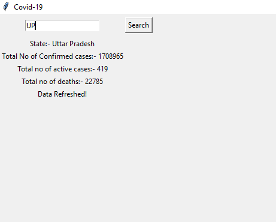
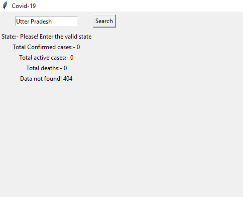

# COVID-19 Data Tracker

<p align="justify">✍This project is a simple GUI application developed in Python using Tkinter. It fetches and displays COVID-19 data for various states in India, such as the total number of confirmed cases, active cases, and deaths.</p>

## Features

- Fetch real-time COVID-19 data from a public API.
- Display data for a specific state based on user input.
- GUI made with Tkinter for easy interaction.

## Getting Started

### Prerequisites

Ensure you have Python installed on your system. This project also requires the `requests` package to fetch data from the API. You can install it using pip:

```bash
pip install requests
```

### Running the Application
- 1.Clone this repository or download the source code.
- 2.Navigate to the project directory in your terminal or command prompt.
- 3.Run the script using Python:

``` bash
python Yuor-file-name.py
```

### Using the Application
- Upon running the script, a window will open.
- Enter the name of the state or the state code for which you want to track COVID-19 data into the input field.
- Click on the "Search" button to fetch and display the data.

### Data Source
- <p align="justify">The COVID-19 data is fetched from https://api.covid19india.org/data.json, a public API providing real-time data on COVID-19 cases in India.</p>


### Output Screen

- When you enter the valid state name see the output.
#### Valid input
  

- When enter the invalid input see the output not showing.
#### Invalid input
  

